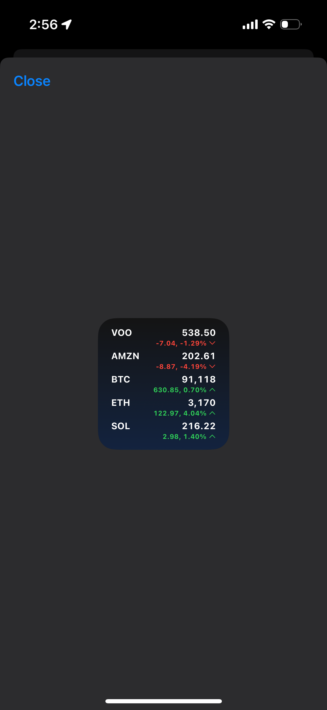
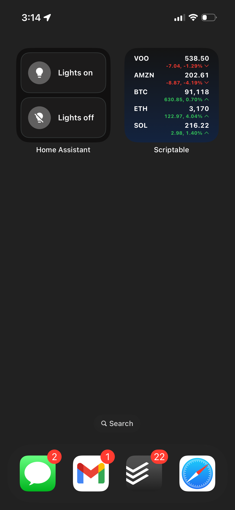

# Stock Widget

No stock widget for iPhone could do these two simple things:

- show me 5 assets
- take up only one tile space

All existing options limited me to 3 assets OR took up massive part of home screen. I just want to:

- see 5 assets
- have it take up only one tile space

I found [Scriptable app](https://scriptable.app/) that lets me run Javascript in a widget. I copied this code: https://gist.github.com/saiteja09/52f15d4b4f30657af51a1336661884a8

And then I altered the following:

- show 5 total assets
- work with both crypto and stocks
  - coinmarketcap integration
  - twelvedata integration
- cache fetched data so when I'm offline (when I don't have service while I'm on the train) it still shows the latest values without crashing
  - also show offline dot to let me know values aren't fetching at the moment

This code could be much better written. I also still need to update stocks to pull current price during active trading hours. But this is fine for now, I need to stop procrastinating and do important things.

I ❤️ Javascript

Here is what it looks like:

